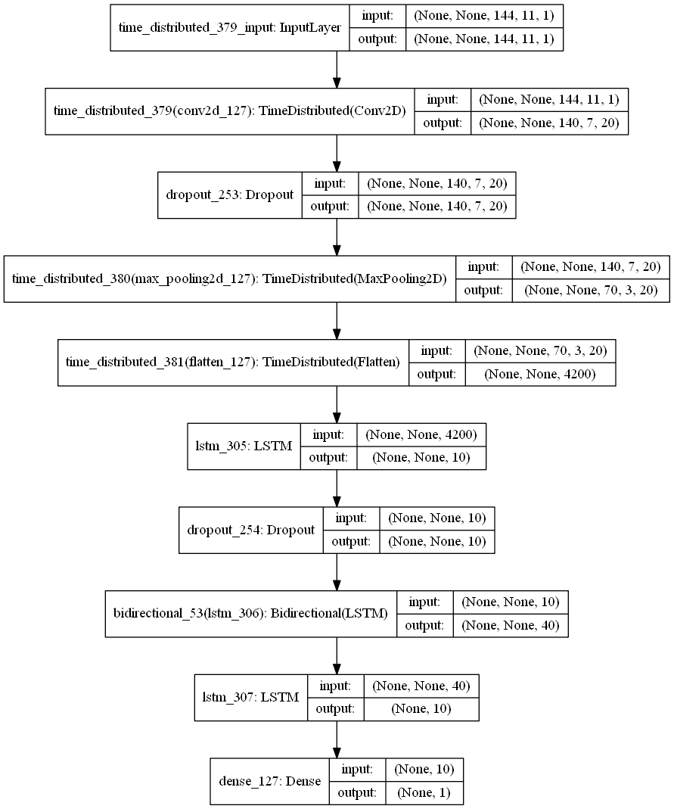
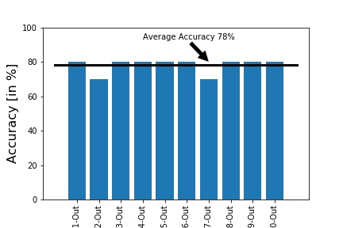
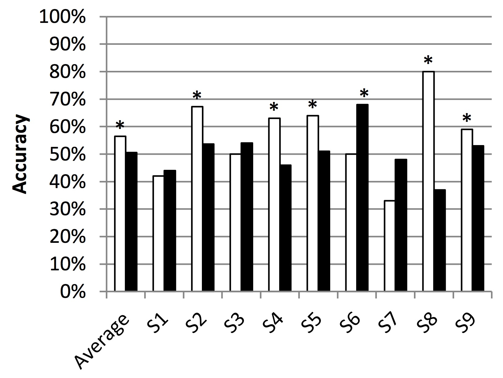
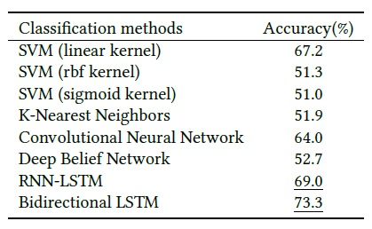

# Bidirectional Recurrent Convolutional Networks for Disentangling Brain Activity from EEG Data

In this study a students' EEG brain activity while watching online courses (video clips) is used to train a classifier that detects when a student is confused. 

A 10-student data set is from the 'EEG brain wave for confusion'; EEG data was collected from 10 students assigned to watch 20 videos.

## Data
A data set is from the 'EEG brain wave for confusion[1]'; EEG data from 10 students assigned to watch 20 videos, after each video, students rated their confusion level on a sclae of 1-7. These labels are quantized into two classes: (i) Confused, and (ii) Not confused
Table 1 shows the features of this data set.

<table style="width:50%">
  <caption>Table 1. EEG brain wave for confusion[1]</caption>
  <tr>
    <th>Feature</th>
  </tr>
  
  <tr>
    <td>Attention - propriatary</td>
  </tr>
  <tr>
    <td>Meditation - propriatary</td>
  </tr>
  <tr>
    <td>Raw EEG signals</td>
    
  </tr>

<tr>
    <td>Theta frequency band</td> 
  </tr>
    <tr>
    <td>Alpha 1 frequency band</td> 
    </tr>
     <tr>
    <td>Alpha 2 frequency band</td> 
    </tr>
    <tr>
    <td>Beta 1 frequency band</td>
    </tr>
     <tr>
    <td>Beta 2 frequency band</td> 
    </tr>
    <tr>
    <td>Gamma 1 frequency band</td>
    </tr>
     <tr>
    <td>Gamma 2 frequency band</td> 
    </tr>
    </table>

## Model
Optimized bidirectional LSTM Neural Networks with a Convolutional layer to extract sequence signal features is used as a classifier with the architecture illsutrated in Fig. 1:

  
  <figcaption>Figure 1 : Model Architecturee</figcaption>

## Result
Here, We trained the model using the data from nine students and tested it on the tenth student. The procedure is performed for each student separately: 

  
  <figcaption>Figure 2 : Experiment-based and Averageaccuracy </figcaption>

Figure 3 and Figure 4 show the recently published results using the same data-set and accuracy metrics.

  
  <figcaption>Figure 3 : Illustrated results in [1] </figcaption>

  
  <figcaption>Figure 4 : Illustrated results in [2] </figcaption>

## Code

<a href="https://github.com/mehmani/DNNs-for-EEG-Signals/blob/master/DNNforEEFSignals.ipynb"> The code is presented here </a>

## References 
[1] Wang, Haohan, Yiwei Li, Xiaobo Hu, Yucong Yang, Zhu Meng, and Kai-min Chang. "Using EEG to Improve Massive Open Online Courses Feedback Interaction." In AIED Workshops. 2013.

[2] Ni, Zhaoheng, Ahmet Cem Yuksel, Xiuyan Ni, Michael I. Mandel, and Lei Xie. "Confused or not Confused?: Disentangling Brain Activity from EEG Data Using Bidirectional LSTM Recurrent Neural Networks." In Proceedings of the 8th ACM International Conference on Bioinformatics, Computational Biology, and Health Informatics, pp. 241-246. ACM, 2017.
